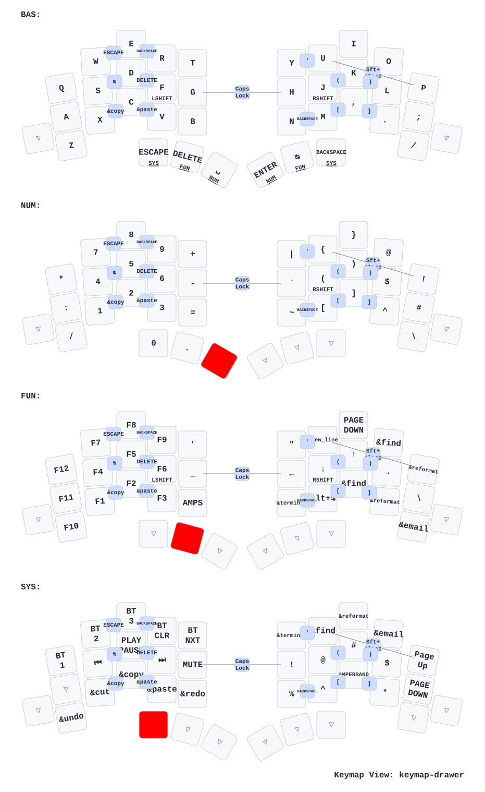
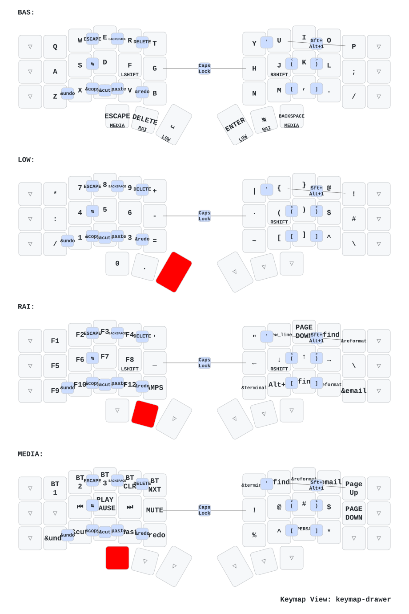

# zmk-config

ZMK firmware config for two split keyboards that share the same keymap:

| Keyboard | Controller | Extras | Keys |
|---|---|---|---|
| **Totem** | Seeed XIAO BLE | – | 38 |
| **Corne** | nice!nano v2 | nice!oled, RGB underglow | 42 (6-column) |

Both keymaps live in [`config/`](config) and are kept in sync. Corne only adds an outer column on each side (mostly `&trans`), so the key positions of combos differ between the two files.

Layout ideas (timeless home-row mods, mod-morphs, combos for brackets) are borrowed from [urob/zmk-config](https://github.com/urob/zmk-config).

## Keymaps

Diagrams are regenerated by [keymap-drawer](https://github.com/caksoylar/keymap-drawer) on every push that touches a keymap.

### Totem

### Corne

## Layers

| # | Layer | Hold | Content |
|---|---|---|---|
| 0 | **BAS** | – | QWERTY with home-row mods |
| 1 | **NUM** | Space / Enter | Left: numpad and math operators. Right: symbols |
| 2 | **FUN** | Delete / Tab | Left: F1–F12. Right: arrows, Home/End, PgUp/PgDn |
| 3 | **SYS** | Esc / Backspace | Left: Bluetooth, media, volume, brightness. Right: macOS (Spaces, screenshots, emoji, Spotlight, lock, Force Quit) |

Press **both NUM thumbs together** (Space + Enter) to toggle NUM on or off, e.g. for typing longer numbers.

## Home-row mods

`A S D F` = Ctrl Alt Cmd Shift, and `J K L ;` mirrors them. These are urob's "timeless" home-row mods (`hml` / `hmr`):

- **Opposite hand only:** a key only acts as a modifier when the next key is on the other hand (or a thumb key). Rolls on the same hand always type letters.
- **Balanced flavor + 170 ms tapping term:** tap vs. hold is decided by which keys you press. The timer is only a fallback.
- **`require-prior-idle-ms = 150`:** during fast typing a home-row key is always a letter. Leave a short pause before a home-row Shift.
- **`quick-tap-ms = 175`:** tap and then hold to repeat the letter.

## Mod-morphs

| Key | Tap | Shift + tap |
|---|---|---|
| `,` | `,` | `;` |
| `.` | `.` | `:` |
| `(` combo | `(` | `<` |
| `)` combo | `)` | `>` |

The `[` and `]` combos give `{` and `}` with Shift without any extra setup.

## Combos

Combos are two neighbouring keys pressed together. Letters below refer to the base layer.

| Keys | Output | Keys | Output |
|---|---|---|---|
| R T | Esc | Y U | `'` |
| S D | Tab | U P | Wispr (⇧⌥1) |
| F G | Enter | H J | Delete |
| G H | Caps word | J K | `(` / `<` |
| Z X | Undo | K L | `)` / `>` |
| X C | Copy | N M | Backspace |
| C V | Paste | M , | `[` / `{` |
| X V | Cut | , . | `]` / `}` |
| V B | Redo | Space Enter | Toggle NUM |

**Caps word** capitalises letters until the next space or punctuation, so `MAX_RETRY_2` can be typed in one go.

## Macros

The macros are single macOS shortcuts, which makes them show up with readable names in keymap-drawer: `undo`, `redo`, `cut`, `copy`, `paste` and `wispr`.

## Building

GitHub Actions ([`build.yaml`](build.yaml)) builds on every push. Download the `.uf2` files from the workflow run and flash each half in bootloader mode.

After re-pairing problems, flash `settings_reset` to both halves first.

Corne firmware includes ZMK Studio (unlocked), so you can remap keys live at [zmk.studio](https://zmk.studio/).

## Modules

Listed in [`config/west.yml`](config/west.yml): ZMK `v0.3.0`, [zmk-nice-oled](https://github.com/mctechnology17/zmk-nice-oled) and the dongle display modules.

---

Based on [mctechnology17/zmk-config](https://github.com/mctechnology17/zmk-config).
